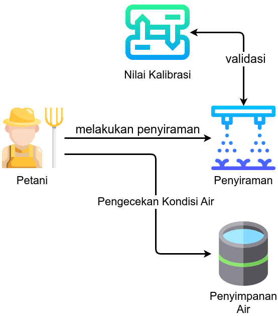
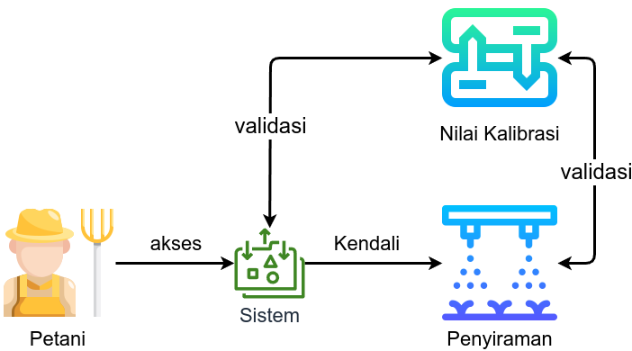
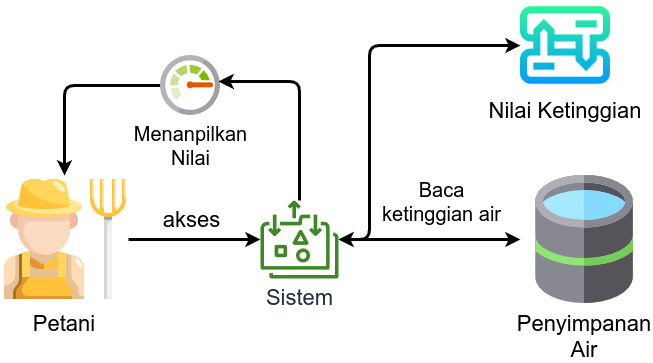
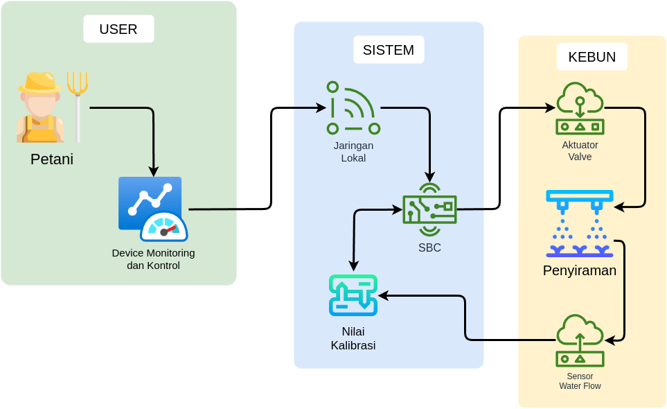
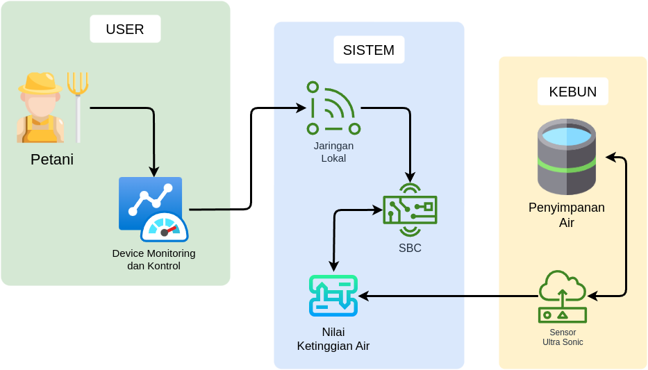

### **PROPOSAL SMART ENERGY**

### **Sistem Monitoring Ketinggian Air Tangki dengan Sensor Ultrasonik dan Kendali Penyiraman Berbasis IoT**

#### Disusun oleh: [Nama Anda]

#### Dedicated Mentor: [Nama]

---

### **BAB I: PENDAHULUAN**

#### 1.1 **Latar Belakang**

Penggunaan air dalam kehidupan sehari-hari dan industri sangat bergantung pada sistem penyimpanan air yang efektif, seperti tangki air. Penyiraman Efisien dan Monitoring ketinggian air yang akurat sangat penting untuk menghindari pemborosan air, serta untuk menjaga agar air tersedia dalam jumlah yang cukup.

POSYANTEKDES (Pos Pelayanan Teknologi Desa) IKHLAS RAMAKU merupakan pusat pelayanan teknologi yang ada di ..... mengalami kendala dalam penggunaan air di musim kemarau di tambah harus bergantung air sumur di karenakan tidak ada sumber air lain. dengan kondisi seperti ini perlunya managemen penggunaan air agar kebutuhan air bisa lebih optimal, untuk itu kami membuat solusinya dengan mengimplementasikanTeknologi Internet of Things (IoT) memungkinkan monitoring dan kendali jarak jauh, yang sangat berguna dalam pengelolaan sumber daya air.

#### 1.2 **Tujuan**

Tujuan dari proyek ini adalah untuk:

- Pengoptimalan penyiraman yang di inginkan pengguna
- Mengembangkan sistem monitoring ketinggian air dalam tangki menggunakan sensor ultrasonik yang terhubung dengan Banana Pi.
- Memungkinkan pengguna untuk memantau ketinggian air secara real-time melalui aplikasi berbasis web.
- Mengurangi pemborosan air dan memberikan kemudahan dalam pengelolaan air.

#### 1.3 **Manfaat**

- **Efisiensi Penyiraman Tanaman**: Pengguna dapat menentukan berapa liter air yang akan di gunakan untuk penyiraman.
- **Efisiensi Pemakaian Air**: Pengguna dapat mengetahui secara tepat jumlah air yang tersedia di dalam tangki, sehingga mencegah kelebihan atau kekurangan air.
- **Kemudahan Monitoring**: Pengguna dapat mengakses data ketinggian air dari mana saja menggunakan perangkat berbasis web.
- **Peningkatan Keamanan**: Sistem memberikan notifikasi otomatis jika ketinggian air melebihi batas yang telah ditentukan.

---

### **BAB II: DESKRIPSI SISTEM**

#### 2.1 **Komponen Sistem**

1. **Water Flow Sensor**: Mengukur kecepatan air yang keluar untuk penyiraman.
2. **Sensor Ultrasonik (HC-SR04)**: Mengukur jarak antara sensor dan permukaan air untuk menentukan ketinggian air di tangki.
3. **Banana Pi**: Sebagai pengontrol dan pengolah data. serta sebagai server utama.
4. **Web Server dan Platform Monitoring**: Untuk menampilkan data ketinggian air secara real-time dan memberikan antarmuka pengguna yang mudah digunakan.
5. **Power Supply**: Untuk memberi daya pada Banana Pi dan sensor. Dapat menggunakan panel surya untuk keperluan energi yang ramah lingkungan.
6. **Selenoid Valve**: Katup pembuka dan penutup penyiraman.
7. **Relay**: Kendali penyiraman menggunakan tekanan air.

#### 2.2 **Prinsip Kerja Sistem**

1. **Pengukuran Kecepatan Air**: Sensor Water Flow akan mengukur sudah berapa liter air yang keluar untuk menentukan kapan penyiraman di hidupkan atau di matikan, yang mana itu bergantung dari nilai input pengguna.
2. **Pengukuran Ketinggian Air**: Sensor ultrasonik HC-SR04 dipasang di bagian atas tangki dan mengirimkan sinyal gelombang suara yang dipantulkan oleh permukaan air. Waktu yang dibutuhkan gelombang untuk kembali dihitung untuk menentukan jarak antara sensor dan permukaan air.
3. **Pengolahan Data di Banana Pi**: Data yang diterima dari sensor akan diproses oleh Banana Pi menggunakan script Python untuk menghitung ketinggian air berdasarkan waktu pantulan sensor. Data ini kemudian akan dikirimkan ke platform web untuk ditampilkan dan juga sebagai server utama.
4. **Platform Monitoring**: Data ketinggian air ditampilkan dalam bentuk grafik atau angka pada dashboard yang dapat diakses melalui web atau aplikasi.

---

### **BAB III: METODOLOGI**

#### 3.1 **Perancangan Sistem**

Sistem ini dirancang dengan pendekatan berikut:

##### 3.1.1 Kebutuhan Fungsional

- Tabel Kebutuhan Fungsional

| Story                                                                                                                                                                          | Tinggi                                                                                                                                                                                                                                                                                                      | Menengah                                                   | Rendah |
| ------------------------------------------------------------------------------------------------------------------------------------------------------------------------------ | ----------------------------------------------------------------------------------------------------------------------------------------------------------------------------------------------------------------------------------------------------------------------------------------------------------- | ---------------------------------------------------------- | ------ |
| Ketika melakukan penyiraman, penggunaan air terdang lebih ataupun kurang yang membuat penyiraman kurang optimal                                                                | - Sistem dapat memberikan pilihan terhadap pengguna untuk menentukan seberapa banyak air yang akan di keluarkan - Sistem dapat menghitung jumlah air yang keluar dengan satuan Liter - Ketika air yang keluar sudah mecapai yang di tentukan, maka sistem secara otomatis menghentikan penyiraman | - Sistem dapat menampilkan air yang keluar secara realtime |        |
| Untuk melakukan penyiraman petani harus mendatangi kendali penyiraman dan selalu mengecek kondisi tanah yang sudah di siram dan juga harus mengecek kondisi air di dalam tanki | - Menerapkan Sistem IoT - Sistem dapat menampilkan persentase air di dalam tanki                                                                                                                                                                                                                       |                                                            |        |

- Tabel Kebutuhan non Fungsional

| Atribut				Kualitas | Definisi				Kebutuhan                                                                                | Cakupan/Bagaimana                                                                                                                                             |
| ------------------- | ---------------------------------------------------------------------------------------------------- | ------------------------------------------------------------------------------------------------------------------------------------------------------------- |
| Performance         | Sistem				harus responsif dan mampu mengirim juga menerma data secara cepat                          | - Sistem dapat mengelola proses dengan cepat dan tepat - Sistem selalu melakukan validata data yang masuk dan keluar, guna meminimalisir kejadian Erorr |
| Usability           | Sistem				harus mudah digunakan dan dipahami oleh pengguna, baik yang				berpengalaman maupun tidak. | - Antarmuka yang mudah dibaca dan di mengerti                                                                                                                 |
| Security            | Sistem				harus aman dari pengguna				dari akses yang tidak sah.                                    | - Menerapkan Standar Securiti IoT - Validasi data yang di Kirim dan di Terima                                                                            |
| Reliability         | Sistem				harus dapat diandalkan dan tersedia untuk digunakan setiap saat.                           | - Pengembangan secara Horizontal                                                                                                                             |
| Safety              | Sistem				harus aman digunakan dan tidak membahayakan pengguna.                                      | - Membuat Cover di setiap device - Sistem berjalan di bawah 15v dengan menggunakan converter                                                             |
|                     |                                                                                                      |                                                                                                                                                               |

##### 3.1.2 DFD (Data Flow Diagram)

- DFD Level 0

- DFD Level 1 A (Penyiraman Kebun)

- DFD Level 1 B (Monitoring Air)

- DFD Level 2 A (Penyiraman Kebun)

- DFD Level 2 B (Monitoring Air)

#### 3.2 Perancangan

##### **3.2.1 Hardware**

##### 3.2.2 Frimware

##### 3.2.3 Software

###### 3.2.1 UI/UX

### **BAB IV: HASIL DAN PEMBAHASAN**

#### 4.1 **Hasil Pengujian**

- Sistem mampu mengukur ketinggian air dengan akurat dalam berbagai kondisi.
- Data ketinggian air dapat ditampilkan secara real-time di platform web dan memberikan notifikasi ketika ketinggian air melebihi atau kurang dari batas yang telah ditentukan.

#### 4.2 **Kelayakan Ekonomi**

Penggunaan sensor ultrasonik dan Banana Pi dalam sistem ini memungkinkan penghematan biaya dibandingkan dengan sistem monitoring berbasis sensor lain. Dengan biaya awal yang relatif rendah dan efisiensi energi, sistem ini sangat layak diterapkan pada skala rumah tangga maupun industri kecil.

---

### **BAB V: PENUTUP**

#### 5.1 **Kesimpulan**

Sistem monitoring ketinggian air berbasis IoT dengan Banana Pi dan sensor ultrasonik merupakan solusi efektif untuk pengelolaan air yang lebih efisien. Dengan kemampuan untuk memonitor dan memberikan notifikasi secara real-time, sistem ini dapat membantu mencegah pemborosan air dan meningkatkan pengelolaan sumber daya air.

#### 5.2 **Saran**

- **Peningkatan Keamanan**: Menambahkan fitur keamanan untuk mencegah akses tidak sah ke platform.
- **Pengembangan Fitur**: Mengembangkan aplikasi mobile untuk mempermudah akses monitoring.

---

### **DAFTAR PUSTAKA**

1. Buku dan artikel terkait penggunaan IoT untuk monitoring lingkungan.
2. Panduan dan dokumentasi untuk Banana Pi dan sensor ultrasonik.
3. Referensi lainnya yang relevan dengan proyek ini.

---

Proposal ini dapat disesuaikan dengan detail teknis lebih lanjut serta dilengkapi dengan rencana anggaran dan timeline yang lebih terperinci. Semoga ini bisa menjadi titik awal yang baik untuk proyek kamu!
