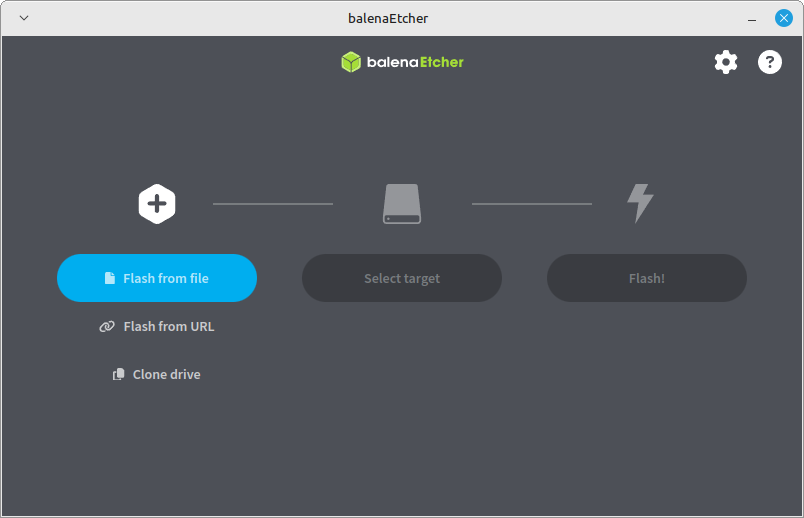
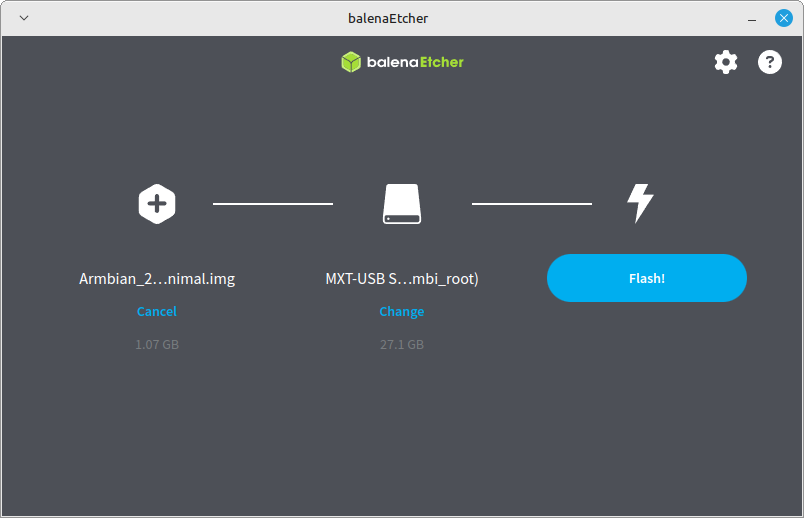
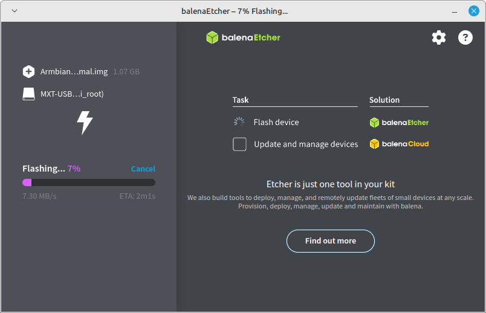
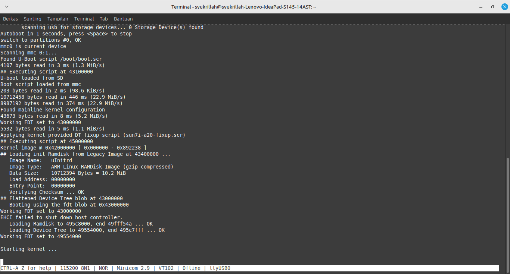
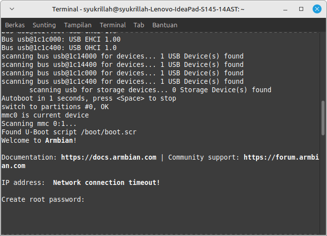
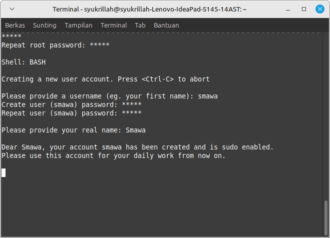
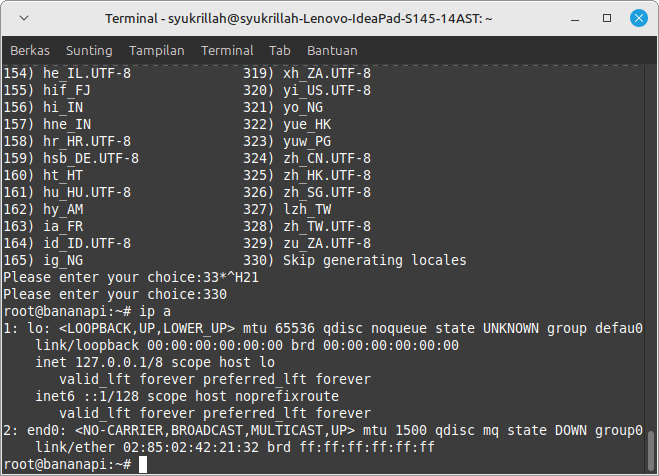
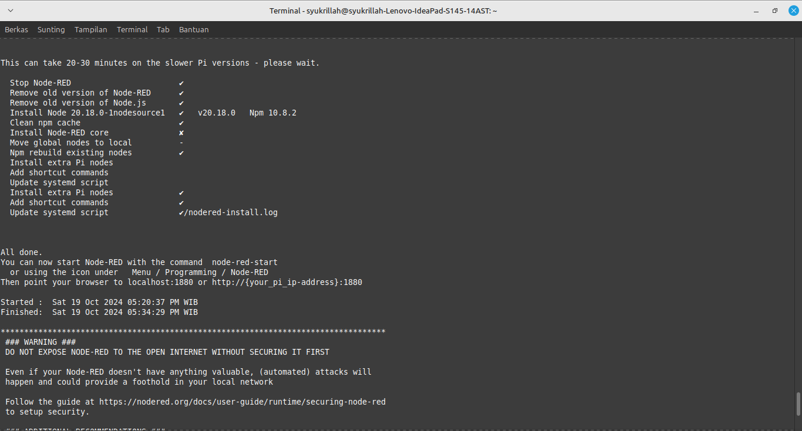
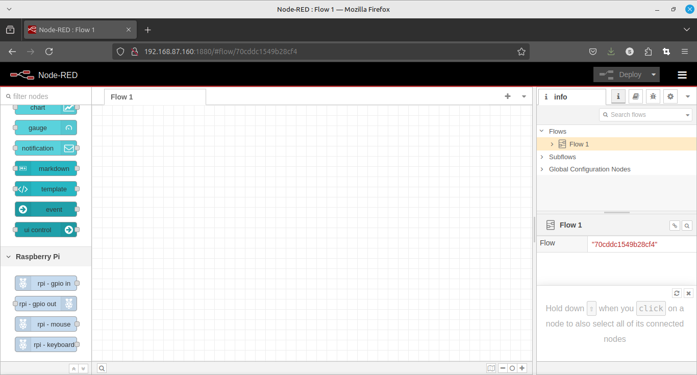

# OS

* unduh OS di https://www.armbian.com/banana-pi-plus/
* unduh Flasher OS https://etcher.balena.io/
  
* Pilih file OS dan SD Card
  
* Flash
  
* hidupkan dan tunggu proses boot
  
* buat password untuk Root
  
* buat user baru
  
* cek wlan
  
* Ganti Versi
  https://drive.google.com/drive/mobile/folders/1VpvVkYMqgmSnmfKXQSrEY2B6wRa-cggL?usp=share_link&sort=13&direction=a
* Hidupkan wlan0 jika mati

  ```bash
  sudo ifconfig wlan0 up
  ```

  scan jaringan tersedia

  ```bash
  sudo iwlist wlan0 scan
  ```

  Hubungkan dengan jaringan

  ```bash
  sudo nmcli dev wifi connect "nama jaringan" password "kata sandi"

  ```

# MQTT Broker

1. install mosquitto

   ```bash
   sudo apt update
   sudo apt install mosquitto mosquitto-clients
   ```
2. Atur agar berjalan otomatis ketika boot

   ```bash
   sudo systemctl enable mosquitto
   ```

   jalankan

   ```bash
   sudo systemctl start mosquitto
   ```
3. Buat user baru

   ```bash
   sudo mosquitto_passwd -c /etc/mosquitto/passwd nama_user
   ```

   konfigurasi pengguna

   ```bash
    sudo nano /etc/mosquitto/mosquitto.conf
   ```

   Tambahakan baris berikut

   ```bash
   allow_anonymous false
   password_file /etc/mosquitto/passwd
   ```
4. Restart mosquitto

   ```bash
   sudo systemctl restart mosquitto
   ```

# Node-Red

1. Install

   ```bash
   bash <(curl -sL https://raw.githubusercontent.com/node-red/linux-installers/master/deb/update-nodejs-and-nodered)
   ```

   
2. Setup agara berjalan pas Boot

   ```bash
   sudo systemctl enable nodered.service
   ```
3. Test
   

# Python3.13

1. Tambah Reposiroty

   ```bash
    sudo add-apt-repository ppa:deadsnakes/ppa
    sudo apt update
   ```
2. Install python3.13

   ```bash
   sudo apt install python3.13 python3.13-dev
   ```
3. Install pip

   ```bash
   curl -sS https://bootstrap.pypa.io/get-pip.py | python3.13
   ```
4. Install pyA20

   ```bash
   pip3.13 install pyA20
   ```
5. Test Python

   ```python
   from time import sleep
   from pyA20.gpio import gpio
   from pyA20.gpio import port

   gpio.init()

   gpio.setcfg(port.PB13, gpio.OUTPUT)

   try:
      while True:
         gpio.output(port.PB13, gpio.HIGH)
         sleep(1)

         gpio.output(port.PB13, gpio.LOW)
         sleep(1)

   except KeyboardInterrupt:
      gpio.output(port.PB13, gpio.LOW)
   ```

   Jalankan program di Boot- Buat file service

   ```bash
   sudo nano /etc/systemd/system/blink.service
   ```

   - Konfigurasi
     ```shell
     [Unit]
     Description=Run Blink Script

     [Service]
     ExecStart=/usr/bin/python3.13 /program/blink.py
     WorkingDirectory=/program
     StandardOutput=inherit
     StandardError=inherit
     Restart=always
     User=root

     [Install]
     WantedBy=multi-user.target
     ```
   - Aktifkan Service
     ```bash
     sudo systemctl enable blink.service
     ```
   - Test
     ```bash
     sudo systemctl start blink.service
     ```

# Acess Point

## Installation

### Generic

```bash
git clone https://github.com/oblique/create_ap
cd create_ap
make install
```

## Examples

### No passphrase (open network):

```bash
create_ap wlan0 eth0 MyAccessPoint
```

### WPA + WPA2 passphrase:

```bash
create_ap wlan0 eth0 MyAccessPoint MyPassPhrase
```

### AP without Internet sharing:

```bash
create_ap -n wlan0 MyAccessPoint MyPassPhrase
```

### Bridged Internet sharing:

```bash
create_ap -m bridge wlan0 eth0 MyAccessPoint MyPassPhrase
```

### Bridged Internet sharing (pre-configured bridge interface):

```bash
create_ap -m bridge wlan0 br0 MyAccessPoint MyPassPhrase
```

### Internet sharing from the same WiFi interface:

```bash
create_ap wlan0 wlan0 MyAccessPoint MyPassPhrase
```

### Start on boot:

```bash
systemctl enable create_ap
```

# Program Blik WiringPi

### For BPI-M1 / M1Plus

```bash
git clone https://github.com/BPI-SINOVOIP/BPI-WiringPi.git -b BPI_M1_M1Plus
```

### Installation

```bash
cd BPI-WiringPi
chmod +x ./build
sudo ./build
```

### Contoh

```c
#include <wiringPi.h>

#define LED 9

int main (void) {
        wiringPiSetup();
        pinMode (LED, OUTPUT) ;
        for (;;) { 
                digitalWrite (LED, HIGH) ;
                delay (500) ;
                digitalWrite (LED, LOW) ;
                delay (500) ;
        }
    return 0 ;
}
```

### Edit Konfiguras

    ```shell
     [Unit]
     Description=Run Blink Script

    [Service]
     ExecStart=/program/hasil_compile.out
     WorkingDirectory=/program
     StandardOutput=inherit
     StandardError=inherit
     Restart=always
     User=root

    [Install]
     WantedBy=multi-user.target
     ```

- Aktifkan Service
  ```bash
  sudo systemctl enable blink.service
  ```
- Test
  ```bash
  sudo systemctl start blink.service
  ```

# GPIO

 +-----+-----+---------+------+---+---Pi ---+---+------+---------+-----+-----+
 | CPU | wPi |   Name  | Mode | V | Physical | V | Mode | Name    | wPi | CPU |
 +-----+-----+---------+------+---+----++----+---+------+---------+-----+-----+
 |     |     |    3.3v |      |   |  1 || 2  |   |      | 5v      |     |     |
 |  53 |   8 |   SDA.1 |  OUT | 0 |  3 || 4  |   |      | 5V      |     |     |
 |  52 |   9 |   SCL.1 |  OUT | 1 |  5 || 6  |   |      | GND     |     |     |
 | 259 |   7 |    GCLK |   IN | 0 |  7 || 8  | 0 | IN   | TxD0    | 15  | 224 |
 |     |     |     GND |      |   |  9 || 10 | 0 | IN   | RxD0    | 16  | 225 |
 | 275 |   0 |    GEN0 |   IN | 0 | 11 || 12 | 0 | IN   | GEN1    | 1   | 226 |
 | 274 |   2 |    GEN2 |   IN | 0 | 13 || 14 |   |      | GND     |     |     |
 | 273 |   3 |    GEN3 |   IN | 0 | 15 || 16 | 0 | IN   | GEN4    | 4   | 244 |
 |     |     |    3.3v |      |   | 17 || 18 | 0 | IN   | GEN5    | 5   | 245 |
 | 268 |  12 |    MOSI |   IN | 0 | 19 || 20 |   |      | GND     |     |     |
 | 269 |  13 |    MISO |   IN | 0 | 21 || 22 | 0 | IN   | GEN6    | 6   | 272 |
 | 267 |  14 |    SCLK |  OUT | 0 | 23 || 24 | 0 | IN   | CE0     | 10  | 266 |
 |     |     |     GND |      |   | 25 || 26 | 0 | IN   | CE1     | 11  | 270 |
 | 257 |  30 |   SDA.0 |   IN | 1 | 27 || 28 | 1 | IN   | SCL.0   | 31  | 256 |
 |  37 |  21 | GPIO.21 |   IN | 0 | 29 || 30 |   |      | GND     |     |     |
 |  38 |  22 | GPIO.22 |   IN | 0 | 31 || 32 | 0 | IN   | GPIO.26 | 26  | 44  |
 |  39 |  23 | GPIO.23 |   IN | 0 | 33 || 34 |   |      | GND     |     |     |
 |  40 |  24 | GPIO.24 |   IN | 0 | 35 || 36 | 0 | IN   | GPIO.27 | 27  | 277 |
 |  35 |  25 | GPIO.25 |   IN | 0 | 37 || 38 | 0 | IN   | GPIO.28 | 28  | 276 |
 |     |     |     GND |      |   | 39 || 40 | 0 | IN   | GPIO.29 | 29  | 45  |
 +-----+-----+---------+------+---+----++----+---+------+---------+-----+-----+
 | CPU | wPi |   Name  | Mode | V | Physical | V | Mode | Name    | wPi | CPU |
 +-----+-----+---------+------+---+---Pi ---+---+------+---------+-----+-----+
